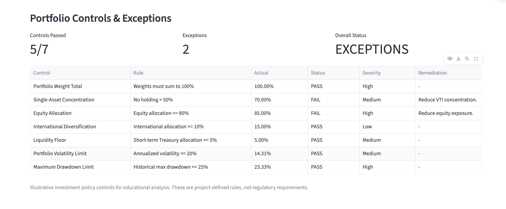
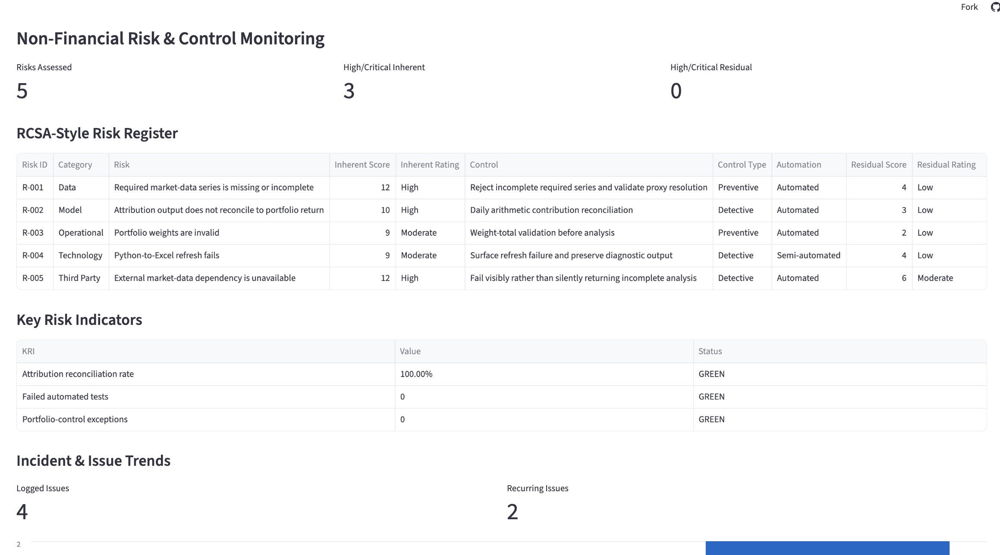

# Portfolio Pulse

**Multi-asset portfolio analytics, risk monitoring, investment-policy controls, and non-financial risk analysis built with Python, Streamlit, and Excel/VBA.**

## Live Demo

**[Launch Portfolio Pulse →](https://charlottekwon-portfolio-pulse.streamlit.app/)**

Portfolio Pulse is an interactive portfolio analytics and risk-monitoring platform for evaluating how asset-allocation decisions affect historical return, downside risk, benchmark-relative performance, and defined risk limits.

The project combines:

- Python portfolio analytics
- Interactive Streamlit analysis
- Excel/VBA reporting and automation
- Historical stress testing
- Return attribution with reconciliation controls
- Allocation sensitivity analysis
- Investment-policy controls and exception monitoring
- NFR-style risk and control monitoring
- RCSA-style inherent and residual risk assessment
- Key Risk Indicators (KRIs)
- Incident and recurring-issue trend analysis
- Automated testing

---

# Demo

### Portfolio Overview


### Historical Risk Analysis


### Attribution & Allocation Sensitivity


### Portfolio Controls & Exceptions



### Non-Financial Risk Monitoring



---

# What Portfolio Pulse Does

Users define a hypothetical portfolio allocation across four asset sleeves:

| ETF | Exposure |
|---|---|
| VTI | U.S. equities |
| VXUS | International equities |
| AGG | U.S. investment-grade bonds |
| SGOV | Short-term U.S. Treasuries |

Portfolio Pulse evaluates the allocation against a **60% VTI / 40% AGG benchmark**.

The investment analytics engine calculates:

- Annualized return
- Annualized volatility
- Sharpe ratio
- Maximum drawdown
- Beta versus the 60/40 benchmark
- Ending portfolio value
- Historical wealth curves
- Historical crisis performance
- Asset-level return contribution
- Allocation sensitivity
- Investment-policy control exceptions

A separate risk-and-control layer extends the platform with:

- Operational risk
- Data risk
- Model risk
- Technology risk
- Third-party risk
- RCSA-style risk assessment
- Inherent and residual risk scoring
- Preventive and detective control classification
- Key Risk Indicators
- Incident and issue logging
- Recurring-issue trend analysis

The same Python analytical logic supports the Streamlit application and Excel/VBA workflow.

---

# Why I Built It

I built Portfolio Pulse to develop a hands-on understanding of portfolio construction, investment risk, and control design beyond standard financial analysis.

The initial question was:

> How can portfolio analytics be rigorous enough to support an investment decision while still being understandable to a non-specialist?

As the project developed, a second question emerged:

> How can analytical rules and operational risks be translated into controls that can be tested, monitored, and escalated?

That led to a system designed around four principles:

### 1. Measure both return and risk

Portfolio performance is evaluated alongside volatility, drawdown, beta, and historical crisis behavior.

### 2. Make assumptions explicit

Historical proxy substitutions and portfolio-control thresholds are disclosed rather than hidden.

### 3. Separate analytics from presentation

Python remains the calculation source of truth while Streamlit and Excel/VBA provide different interfaces.

### 4. Make controls operational

Defined rules are translated into testable thresholds, exceptions, KRIs, and risk-monitoring workflows.

---

# Architecture

```text
                         Market Data
                              │
                              ▼
                           data.py
                              │
                              ▼
                 portfolio.py + analytics.py
                              │
                              ▼
                      market_engine.py
                              │
             ┌────────────────┼─────────────────┐
             │                │                 │
             ▼                ▼                 ▼
       Stress Testing    Attribution       Sensitivity
                              │
                              ▼
                     Reconciliation Control
                              │
                              ▼
                        controls.py
                              │
                   Investment-Policy Rules
                              │
                              ▼
                         PASS / FAIL
                              │
                              ▼
                  Exception + Severity
                              │
                              ▼
                         Remediation
                              │
                              ▼
                           nfr.py
                              │
              ┌───────────────┼────────────────┐
              ▼               ▼                ▼
          Risk Register       KRIs        Incident Log
              │                                  │
              ▼                                  ▼
       RCSA-Style Scoring                 Trend Analysis
              │
              ▼
     Inherent → Controls → Residual Risk
                              │
                 ┌────────────┴────────────┐
                 ▼                         ▼
             Streamlit                 Excel / VBA
```

The analytical, controls, and presentation layers are separated so calculations and risk logic can be tested independently.

---

# Investment Analytics

## Portfolio Performance

Portfolio Pulse evaluates historical portfolio performance using:

- Annualized return
- Ending wealth
- Benchmark-relative return

## Portfolio Risk

Risk analysis includes:

- Annualized volatility
- Maximum drawdown
- Beta versus the 60/40 benchmark
- Historical stress scenarios

This allows portfolio decisions to be evaluated based on both the return generated and the risk required to generate it.

---

# Historical Stress Testing

Portfolio Pulse evaluates portfolio behavior during three distinct historical market environments.

### Global Financial Crisis

Captures an equity and credit-market crisis in which portfolio losses and recovery behavior can be evaluated under severe financial stress.

### COVID Shock

Captures the rapid 2020 equity-market selloff and subsequent recovery.

### 2022 Inflation / Rate Shock

Captures an environment in which rising inflation and interest rates pressured both equities and duration-sensitive fixed income.

For each scenario, the system evaluates:

- Period return
- Maximum drawdown
- Peak date
- Trough date
- Recovery date

Historical stress testing is descriptive rather than predictive.

---

# Historical Proxy Methodology

One practical challenge is that several ETFs in the current portfolio did not exist during earlier market crises.

Portfolio Pulse does **not** silently remove those exposures or pretend that current ETFs have longer histories than they actually do.

Instead, current-fund analysis is separated from historical scenario analysis, and disclosed historical proxies are used where necessary.

Examples include:

```text
VXUS → VEU
SGOV → SHY
```

The application records these substitutions explicitly.

Automated tests also verify that historical proxy resolution does not silently drop an asset from a stress scenario.

---

# Return Attribution

Portfolio Pulse calculates asset-level daily arithmetic contribution as:

```text
Daily Contribution = Portfolio Weight × Asset Daily Return
```

The system then performs a reconciliation check:

```text
Σ Asset Contributions = Portfolio Daily Return
```

This verifies that the attribution output ties back to the underlying portfolio return.

Multi-period results are therefore described as **cumulative arithmetic contribution**.

The project deliberately does **not** label this analysis as Brinson attribution.

---

# Allocation Sensitivity

Portfolio Pulse evaluates controlled allocation changes around the selected portfolio.

Current scenarios include:

```text
Base Portfolio

5% VTI → AGG
10% VTI → AGG

5% AGG → VTI
10% AGG → VTI
```

For each scenario, the engine recalculates:

- CAGR
- Annualized volatility
- Sharpe ratio
- Maximum drawdown
- Ending portfolio value

The purpose is to make the historical trade-off between additional equity exposure, return potential, and downside risk visible.

---

# Investment-Policy Controls

## Portfolio Controls & Exception Monitoring

Portfolio Pulse includes an automated investment-policy controls layer that translates defined portfolio rules into testable thresholds.


The controls workflow follows:

```text
Policy Rule
    │
    ▼
Automated Control
    │
    ▼
Portfolio Test
    │
    ▼
 PASS / FAIL
    │
    ▼
Exception + Severity
    │
    ▼
Remediation
```

## Current Controls

The default policy evaluates seven rules:

| Control | Rule |
|---|---|
| Portfolio Weight Total | Weights must equal 100% |
| Single-Asset Concentration | No holding exceeds 50% |
| Equity Allocation | Total equity exposure does not exceed 80% |
| International Diversification | International allocation is at least 10% |
| Liquidity Floor | Short-term Treasury allocation is at least 5% |
| Portfolio Volatility | Annualized volatility does not exceed 20% |
| Maximum Drawdown | Historical maximum drawdown does not exceed 25% |

Each control produces:

- PASS / FAIL status
- Observed value
- Policy threshold
- Severity
- Remediation guidance when an exception occurs

For example:

```text
Control: Single-Asset Concentration
Rule: No holding > 50%
Actual: 70%
Status: FAIL
Severity: Medium
Remediation: Reduce concentrated asset exposure.
```

This turns portfolio rules into an operational workflow rather than leaving them as descriptive guidelines.

### Investment-Policy Controls Disclaimer

These thresholds are **project-defined investment-policy rules created for educational analysis**.

They are not regulatory requirements, and Portfolio Pulse should not be interpreted as a regulatory compliance system.

---

# Non-Financial Risk Framework

## Non-Financial Risk & Control Monitoring

Portfolio Pulse extends its investment controls with an educational **non-financial risk (NFR) and controls framework**.

### NFR Risk Dashboard


The framework demonstrates how risks can move through a structured lifecycle:

```text
Risk Identification
        │
        ▼
Risk Assessment
        │
        ▼
Control Identification
        │
        ▼
Residual Risk
        │
        ▼
KRI Monitoring
        │
        ▼
Incident / Issue Management
        │
        ▼
Trend Analysis
```

---

## Risk Taxonomy

The framework currently covers five NFR categories:

| Risk Category | Portfolio Pulse Example |
|---|---|
| Operational Risk | Invalid portfolio inputs or workflow failures |
| Data Risk | Missing market data, incomplete histories, or proxy-resolution issues |
| Model Risk | Analytical outputs failing reconciliation or methodology controls |
| Technology Risk | Python/Excel refresh failures or application errors |
| Third-Party Risk | External market-data dependency failures |

This taxonomy allows technical and analytical failures to be treated as identifiable risk events rather than isolated application errors.

---

# RCSA-Style Risk Assessment

Each identified risk is assessed using a simplified **Risk and Control Self-Assessment (RCSA)-style methodology**.

Likelihood and impact are each scored from **1 to 5**.

```text
Risk Score = Likelihood × Impact
```

The framework calculates risk both before and after controls:

```text
Risk
 │
 ▼
Inherent Risk
 │
 ▼
Control
 │
 ▼
Residual Risk
```

## Risk Ratings

| Score | Rating |
|---:|---|
| 1–4 | Low |
| 5–9 | Moderate |
| 10–15 | High |
| 16–25 | Critical |

For example:

```text
Risk:
Required market-data series is missing or incomplete

Inherent Likelihood: 3
Inherent Impact: 4

Inherent Risk Score: 12
Inherent Rating: High

Control:
Reject incomplete required series and validate proxy resolution

Residual Likelihood: 1
Residual Impact: 4

Residual Risk Score: 4
Residual Rating: Low
```

This makes the intended effect of a control visible rather than simply recording whether a control exists.

---

# Control Classification

Controls are classified across two dimensions.

## Control Purpose

**Preventive controls** are designed to stop an issue before it affects the analysis.

**Detective controls** identify an issue after or as it occurs.

## Execution

Controls are also classified as:

- Automated
- Semi-automated

Examples include:

| Risk | Control | Type | Execution |
|---|---|---|---|
| Missing market data | Reject incomplete required series and validate proxy resolution | Preventive | Automated |
| Attribution mismatch | Daily contribution reconciliation | Detective | Automated |
| Invalid portfolio weights | Weight-total validation | Preventive | Automated |
| Excel/Python refresh failure | Surface refresh failure and diagnostic output | Detective | Semi-automated |
| Third-party data failure | Fail visibly rather than silently returning incomplete analysis | Detective | Automated |

---

# Key Risk Indicators

The NFR dashboard includes project-defined **Key Risk Indicators (KRIs)** for ongoing monitoring.

Current KRIs include:

| KRI | Monitoring Objective |
|---|---|
| Attribution reconciliation rate | Detect analytical reconciliation failures |
| Failed automated tests | Monitor validated analytical and control logic |
| Portfolio-control exceptions | Monitor breaches of defined investment-policy thresholds |

KRIs are evaluated against defined thresholds and assigned:

```text
GREEN
AMBER
RED
```

This separates **ongoing risk monitoring** from one-time risk assessment.

---

# Incident & Issue Management

Portfolio Pulse maintains a structured incident and issue log.

Each issue records:

- Date
- Risk category
- Issue
- Severity
- Root cause
- Control involved
- Remediation
- Resolution time
- Recurrence

The current dataset uses development issues encountered while building Portfolio Pulse, including:

- Excel/Python refresh failures
- Workbook merged-cell write failures
- Historical ETF data gaps
- Attribution reconciliation requirements

The framework treats these as risk and control events that can be categorized, remediated, and analyzed over time.

---

# Incident Trend Analysis

Incident data is aggregated to identify:

- Total logged issues
- Recurring issues
- Issues by risk category
- Issues by severity

The resulting workflow is:

```text
Incident
    │
    ▼
Root Cause
    │
    ▼
Remediation
    │
    ▼
Recurrence Monitoring
    │
    ▼
Trend Analysis
```

This allows recurring operational or technical issues to be distinguished from isolated failures.

---

# NFR Framework Disclaimer

The NFR module is an **educational risk-and-controls implementation**.

It uses RCSA-style concepts, project-defined KRIs, risk taxonomy, control classification, incident management, and residual-risk analysis to demonstrate risk-management principles.

It is **not** a bank's proprietary RCSA methodology, a regulatory compliance system, or evidence of professional regulatory-compliance certification.

---

# Application Interfaces

## Streamlit Application

The Streamlit interface provides interactive allocation controls and recalculates portfolio analytics as the allocation changes.

The application includes:

- Portfolio allocation sliders
- Portfolio snapshot KPIs
- Investment-policy control results
- Exception monitoring
- RCSA-style risk register
- Inherent and residual risk monitoring
- KRIs
- Incident and issue trends
- Portfolio vs. benchmark wealth curve
- Historical stress tests
- Return-driver visualization
- Allocation sensitivity analysis
- Methodology and limitations

### Run Locally

Install dependencies:

```bash
python3 -m pip install -r requirements.txt
```

Launch the application:

```bash
python3 -m streamlit run app.py
```

Or use the deployed version:

**[Launch Portfolio Pulse →](https://charlottekwon-portfolio-pulse.streamlit.app/)**

---

# Excel + VBA Workflow

Portfolio Pulse also includes an analyst-style Excel implementation.

The Excel workflow supports:

- Editable portfolio inputs
- Allocation validation
- Python-driven analytics refresh
- Portfolio KPIs
- Historical stress-test outputs
- Wealth-curve visualization
- Return attribution
- Allocation sensitivity
- Automated reporting

VBA provides the interaction and automation layer while Python remains the analytical engine.

This allows portfolio analysis to be consumed through a familiar spreadsheet workflow without duplicating the underlying financial calculations.

---

# Automated Testing

Portfolio Pulse currently includes **13 automated tests**.

Run the complete test suite with:

```bash
python3 -m pytest tests -v
```

The tests cover:

1. Portfolio-weight normalization
2. Weighted portfolio-return calculation
3. Zero-volatility behavior
4. Maximum-drawdown calculation
5. Attribution reconciliation to portfolio return
6. Compliant portfolio-control evaluation
7. Portfolio-control exception detection
8. Historical proxy resolution
9. Prevention of silent asset dropping during proxy resolution
10. NFR risk scoring
11. Invalid risk-score handling
12. KRI threshold evaluation
13. Incident trend aggregation

A successful run returns:

```text
============================== 13 passed ==============================
```

Testing is particularly important for the attribution, controls, and NFR layers because these features are intended to identify, explain, or monitor risk rather than simply display statistics.

---

# Project Structure

```text
portfolio-pulse/
│
├── app.py
├── analytics.py
├── attribution.py
├── controls.py
├── data.py
├── market_engine.py
├── nfr.py
├── portfolio.py
├── scenarios.py
├── sensitivity.py
│
├── excel_bidirectional.py
│
├── requirements.txt
├── requirements_streamlit.txt
├── README.md
│
├── nfr_data/
│   ├── incidents.csv
│   └── risk_register.csv
│
├── tests/
│   ├── test_analytics.py
│   ├── test_attribution.py
│   ├── test_controls.py
│   ├── test_data.py
│   └── test_nfr.py
│
├── assets/
│   ├── portfolio-overview.png
│   ├── stress-testing.png
│   ├── allocation-analysis.png
│   ├── portfolio-controls.png
│   └── nfr-risk-monitoring.png
│
└── excel/
    ├── Portfolio_Pulse_Analysis.xlsm
    ├── Portfolio_Pulse_Report.pdf
    ├── README_VBA.md
    │
    └── vba/
        ├── AddAttributionChart.bas
        ├── AddSensitivityChart.bas
        ├── AddWealthCurveChart.bas
        ├── BuildDashboard.bas
        ├── GenerateReport.bas
        ├── PortfolioChecks.bas
        ├── RefreshData.bas
        ├── RefreshPortfolio.bas
        ├── ReportGenerator.bas
        ├── StressTesting.bas
        └── ValidatePortfolio.bas
```

---

# Tech Stack

### Finance & Data

- Python
- pandas
- NumPy
- yfinance

### Application

- Streamlit

### Risk & Controls

- Investment-policy controls
- RCSA-style risk scoring
- Key Risk Indicators
- Exception monitoring
- Incident trend analysis

### Spreadsheet Automation

- Microsoft Excel
- VBA
- openpyxl

### Testing

- pytest

### Version Control & Deployment

- Git
- GitHub
- Streamlit Community Cloud

---

# Key Takeaways

### Diversification is about risk exposure, not asset count

Adding more asset classes does not automatically reduce drawdown. The underlying exposures and their behavior across market regimes matter more than the number of holdings.

### Ending return can hide path risk

Two portfolios can produce similar ending wealth while exposing an investor to very different drawdowns and recovery periods.

### Stock/bond diversification is regime-dependent

The 2022 inflation and rate shock demonstrates that equities and bonds do not necessarily offset one another in every environment.

### Benchmark-relative performance needs risk context

Outperforming a benchmark is more informative when considered alongside volatility, drawdown, beta, and the additional risk required to generate that return.

### Controls make analytical rules operational

A portfolio rule becomes more useful when it can be translated into a testable threshold, evaluated consistently, and surfaced as an exception when breached.

### Inherent risk and residual risk answer different questions

Assessing risk before and after a control makes the intended effect of the control visible and separates the underlying exposure from the remaining risk.

### KRIs turn risk assessment into ongoing monitoring

A risk register identifies risks at a point in time. KRIs provide a mechanism for observing whether the underlying risk or control environment changes.

### Incidents can reveal patterns

Logging root cause, remediation, severity, and recurrence makes it possible to distinguish isolated failures from repeated control or process weaknesses.

### Reconciliation matters

Analytical outputs should tie back to their underlying calculations. The attribution reconciliation control verifies that reported asset contributions reproduce portfolio daily return.

### Transparency matters when historical data is incomplete

When an ETF does not have sufficient history for a stress scenario, explicitly documenting a reasonable proxy is more defensible than silently dropping the exposure.

---

# Limitations

Portfolio Pulse is an educational analytics and risk-management project.

Important limitations include:

- Historical performance does not predict future results.
- The portfolio uses a limited ETF universe.
- ETF inception dates constrain common-history analysis.
- Historical proxies approximate exposures and are not perfect replicas of later ETFs.
- Sharpe-ratio results depend on the selected risk-free-rate methodology.
- Historical stress tests are descriptive, not predictive.
- Sensitivity scenarios are illustrative rather than optimization recommendations.
- Portfolio-control thresholds are project-defined rules, not regulatory requirements.
- RCSA scoring and KRIs are simplified, project-defined implementations.
- The NFR framework is not a proprietary institutional risk methodology.
- Portfolio Pulse does not provide personalized investment advice.

---

# Live Application

**[Launch Portfolio Pulse →](https://charlottekwon-portfolio-pulse.streamlit.app/)**

Built as an independent portfolio analytics and risk-controls project using Python, Streamlit, Excel, and VBA.