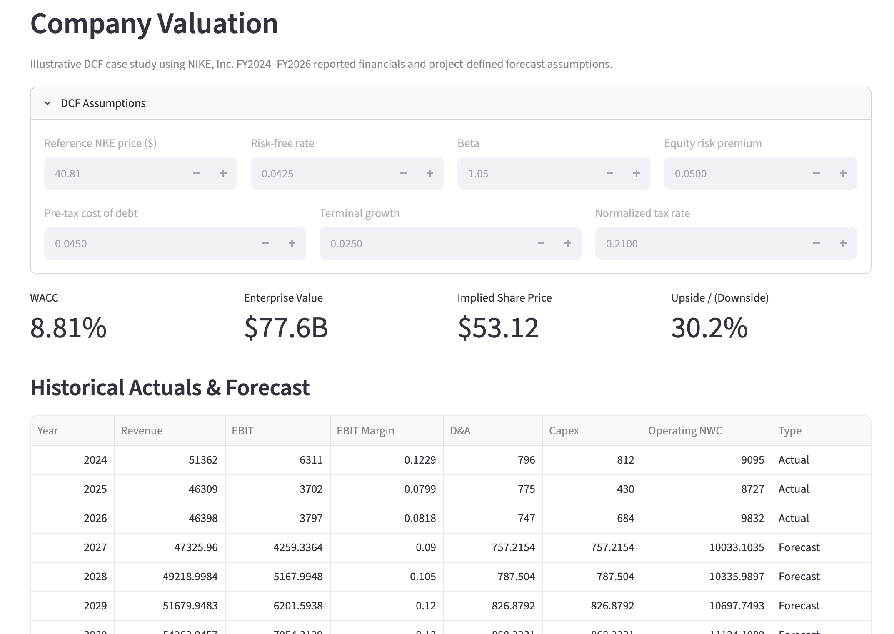

# Portfolio Pulse

**Multi-asset portfolio analytics, company valuation, investment-policy
controls, and non-financial risk monitoring built with Python,
Streamlit, and Excel/VBA.**

## Live Demo

**Launch Portfolio Pulse:**
https://charlottekwon-portfolio-pulse.streamlit.app/

Portfolio Pulse is an interactive investment analytics platform for
evaluating portfolio allocation, historical risk, company valuation, and
defined risk controls.

The project combines:

-   Multi-asset portfolio analytics
-   Benchmark-relative performance analysis
-   Historical stress testing
-   Return attribution and reconciliation
-   Allocation sensitivity analysis
-   Public-company DCF valuation
-   WACC and terminal-value analysis
-   Valuation sensitivity analysis
-   Investment-policy controls and exception monitoring
-   RCSA-style non-financial risk assessment
-   Key Risk Indicators
-   Incident and recurring-issue analysis
-   Streamlit deployment
-   Excel/VBA reporting and automation
-   Automated testing

------------------------------------------------------------------------

## Demo

### Portfolio Overview


### Historical Stress Testing


### Attribution & Allocation Sensitivity


### Portfolio Controls & Exceptions


### Non-Financial Risk Monitoring


### Company Valuation - NIKE DCF



------------------------------------------------------------------------

## What Portfolio Pulse Does

Portfolio Pulse consists of four connected analytical layers:

``` text
Portfolio Analytics
        |
        +-- Performance & Risk
        +-- Benchmarking
        +-- Stress Testing
        +-- Attribution
        +-- Allocation Sensitivity
        |
        v
Company Valuation
        |
        +-- Historical Financials
        +-- Financial Forecast
        +-- UFCF
        +-- WACC
        +-- Terminal Value
        +-- Implied Equity Value
        |
        v
Investment Controls
        |
        +-- Policy Rules
        +-- Automated Tests
        +-- Exceptions
        +-- Remediation
        |
        v
Non-Financial Risk
        |
        +-- Risk Register
        +-- RCSA-Style Assessment
        +-- KRIs
        +-- Incident Trends
```

The goal is to demonstrate not only how investment decisions can be
analyzed, but also how financial models can be validated, controlled,
and communicated.

------------------------------------------------------------------------

## 1. Portfolio Analytics

Users define a hypothetical allocation across four ETF sleeves:

  ETF    Exposure
  ------ -----------------------------
  VTI    U.S. equities
  VXUS   International equities
  AGG    U.S. investment-grade bonds
  SGOV   Short-term U.S. Treasuries

Portfolio Pulse evaluates the allocation against a **60% VTI / 40% AGG
benchmark**.

### Portfolio Metrics

The analytics engine calculates:

-   Annualized return
-   Annualized volatility
-   Sharpe ratio
-   Maximum drawdown
-   Beta versus the 60/40 benchmark
-   Ending portfolio value
-   Historical wealth curves

The objective is to evaluate performance alongside the amount and type
of risk required to generate it.

------------------------------------------------------------------------

## 2. Historical Stress Testing

Portfolio Pulse evaluates allocations across three historical market
environments:

-   Global Financial Crisis
-   COVID Shock
-   2022 Inflation / Rate Shock

For each scenario, the system calculates:

-   Period return
-   Maximum drawdown
-   Peak date
-   Trough date
-   Recovery date

Historical stress testing is descriptive rather than predictive.

------------------------------------------------------------------------

## 3. Historical Proxy Methodology

Several ETFs in the current portfolio did not exist during earlier
market crises. Portfolio Pulse does **not** silently remove these
exposures or assign them histories they did not have.

Instead, current-fund analysis is separated from historical scenario
analysis and disclosed historical proxies are used where required.

Examples:

``` text
VXUS -> VEU
SGOV -> SHY
```

Automated tests verify that proxy resolution never silently removes a
required portfolio exposure.

------------------------------------------------------------------------

## 4. Return Attribution

Portfolio Pulse calculates asset-level daily arithmetic contribution as:

``` text
Daily Contribution = Portfolio Weight x Asset Daily Return
```

A reconciliation control verifies:

``` text
Sum of Asset Contributions = Portfolio Daily Return
```

This ensures the attribution output ties back to the underlying
portfolio calculation. Multi-period results are described as
**cumulative arithmetic contribution**. The analysis is deliberately not
labeled as Brinson attribution.

------------------------------------------------------------------------

## 5. Allocation Sensitivity

Portfolio Pulse evaluates controlled allocation changes around the
selected portfolio.

Current scenarios include:

``` text
Base Portfolio
5% VTI -> AGG
10% VTI -> AGG
5% AGG -> VTI
10% AGG -> VTI
```

For each scenario, the engine recalculates CAGR, annualized volatility,
Sharpe ratio, maximum drawdown, and ending portfolio value.

------------------------------------------------------------------------

## 6. Company Valuation

Portfolio Pulse includes a public-company DCF valuation module using
**NIKE, Inc.** as the initial case study.

The model separates FY2024A-FY2026A reported historical financials from
project-defined 2027E-2031E forecast assumptions.

``` text
Historical Financials
        |
        v
Revenue Forecast
        |
        v
EBIT / Taxes / D&A / Capex / Delta NWC
        |
        v
Unlevered Free Cash Flow
        |
        v
WACC
        |
        v
PV of Forecast UFCF + Terminal Value
        |
        v
Enterprise Value - Net Debt
        |
        v
Equity Value / Diluted Shares
        |
        v
Implied Share Price
```

Historical financials are sourced from NIKE's FY2026 and FY2025 SEC
filings. Forecast assumptions are project-defined and explicitly
separated from reported historical results.

------------------------------------------------------------------------

## 7. Unlevered Free Cash Flow

The DCF calculates:

``` text
UFCF =
EBIT x (1 - Tax Rate)
+ D&A
- Capital Expenditures
- Change in Net Working Capital
```

The real-company model calculates **2027E Change in NWC against FY2026
actual operating NWC**, avoiding the generic prototype's first-year
zero-working-capital shortcut.

For this project:

``` text
Operating NWC =
Accounts Receivable
+ Inventory
- Accounts Payable
```

------------------------------------------------------------------------

## 8. WACC

Cost of equity is estimated using CAPM:

``` text
Cost of Equity =
Risk-Free Rate
+ Beta x Equity Risk Premium
```

After-tax cost of debt:

``` text
After-Tax Cost of Debt =
Pre-Tax Cost of Debt x (1 - Tax Rate)
```

WACC uses market-value capital weights:

``` text
WACC =
(E / (D + E)) x Cost of Equity
+
(D / (D + E)) x After-Tax Cost of Debt
```

The Streamlit application allows users to modify reference share price,
risk-free rate, beta, equity risk premium, pre-tax cost of debt,
normalized tax rate, and terminal growth rate.

------------------------------------------------------------------------

## 9. Terminal Value

Portfolio Pulse uses the Gordon Growth methodology:

``` text
Terminal Value =
Final-Year UFCF x (1 + g)
-------------------------
WACC - g
```

The valuation engine prevents calculation when WACC is less than or
equal to terminal growth.

------------------------------------------------------------------------

## 10. Enterprise-to-Equity Value Bridge

The model converts operating-asset value into shareholder value:

``` text
PV of Forecast UFCF
+ PV of Terminal Value
= Enterprise Value

Enterprise Value
- Net Debt
= Equity Value

Equity Value
/ Diluted Shares
= Implied Share Price
```

The resulting implied share price is compared with the selected
reference market price. This comparison is illustrative and is not an
investment recommendation.

------------------------------------------------------------------------

## 11. Valuation Sensitivity

Portfolio Pulse includes a **5x5 WACC / terminal-growth sensitivity
table**.

The engine recalculates implied share price across combinations of WACC
and terminal growth. The table makes two core valuation relationships
visible:

``` text
Higher WACC -> Lower Valuation
Higher Terminal Growth -> Higher Valuation
```

Automated tests verify that the model behaves consistently with these
relationships.

------------------------------------------------------------------------

## 12. Investment-Policy Controls

Portfolio Pulse translates project-defined portfolio rules into
automated tests.

``` text
Policy Rule
    |
    v
Automated Control
    |
    v
Portfolio Test
    |
    v
PASS / FAIL
    |
    v
Exception + Severity
    |
    v
Remediation
```

Current controls cover:

  -----------------------------------------------------------------------
  Control                             Rule
  ----------------------------------- -----------------------------------
  Portfolio Weight Total              Weights must equal 100%

  Single-Asset Concentration          No holding exceeds 50%

  Equity Allocation                   Total equity exposure does not
                                      exceed 80%

  International Diversification       International allocation is at
                                      least 10%

  Liquidity Floor                     Short-term Treasury allocation is
                                      at least 5%

  Portfolio Volatility                Annualized volatility does not
                                      exceed 20%

  Maximum Drawdown                    Historical maximum drawdown does
                                      not exceed 25%
  -----------------------------------------------------------------------

Each control produces PASS/FAIL status, observed value, policy
threshold, severity, and remediation guidance. These thresholds are
project-defined investment-policy rules created for educational
analysis, not regulatory requirements.

------------------------------------------------------------------------

## 13. Non-Financial Risk Framework

Portfolio Pulse extends the investment controls with an educational
**non-financial risk and controls framework**.

The framework covers:

-   Operational risk
-   Data risk
-   Model risk
-   Technology risk
-   Third-party risk

It follows a simplified workflow of risk identification, risk
assessment, control identification, residual-risk assessment, KRI
monitoring, incident management, and trend analysis.

------------------------------------------------------------------------

## 14. RCSA-Style Risk Assessment

Each risk is assessed using a simplified RCSA-style methodology.

``` text
Risk Score = Likelihood x Impact
```

Likelihood and impact are scored from 1 to 5. The framework
distinguishes inherent risk from residual risk after controls.

    Score Rating
  ------- ----------
      1-4 Low
      5-9 Moderate
    10-15 High
    16-25 Critical

------------------------------------------------------------------------

## 15. Control Classification

Controls are classified as preventive or detective, and as automated or
semi-automated.

Examples include market-data validation, attribution reconciliation,
portfolio-weight validation, Excel/Python refresh diagnostics, and
visible handling of third-party data failures.

------------------------------------------------------------------------

## 16. Key Risk Indicators

Current project-defined KRIs include:

  -----------------------------------------------------------------------
  KRI                                 Objective
  ----------------------------------- -----------------------------------
  Attribution reconciliation rate     Detect analytical reconciliation
                                      failures

  Failed automated tests              Monitor validated
                                      analytical/control logic

  Portfolio-control exceptions        Monitor breaches of defined
                                      thresholds
  -----------------------------------------------------------------------

KRIs are evaluated against thresholds and assigned GREEN, AMBER, or RED
status.

------------------------------------------------------------------------

## 17. Incident & Issue Management

Portfolio Pulse maintains a structured incident log with fields for
date, risk category, issue, severity, root cause, control involved,
remediation, resolution time, and recurrence.

Incident data is aggregated to identify total issues, recurring issues,
issues by category, and issues by severity.

------------------------------------------------------------------------

## 18. Excel + VBA Workflow

Portfolio Pulse also includes an analyst-style Excel implementation
supporting editable portfolio inputs, allocation validation,
Python-driven analytics refresh, portfolio KPIs, historical stress-test
outputs, wealth-curve visualization, return attribution, allocation
sensitivity, and automated reporting.

VBA provides the spreadsheet interaction and automation layer while
Python remains the analytical engine.

------------------------------------------------------------------------

## 19. Automated Testing

Run:

``` bash
python3 -m pytest tests -v
```

Tests cover portfolio calculations, attribution reconciliation,
historical proxy resolution, investment-control exceptions, NFR
scoring/KRIs/incidents, UFCF, WACC, terminal-value guardrails,
enterprise-to-equity bridging, first-year working capital, forecast
compounding, and valuation sensitivity.

Use the exact local pytest result when stating the current test count.

------------------------------------------------------------------------

## 20. Project Structure

``` text
portfolio-pulse/
|
+-- app.py
+-- analytics.py
+-- attribution.py
+-- controls.py
+-- data.py
+-- market_engine.py
+-- nfr.py
+-- nike_dcf.py
+-- portfolio.py
+-- scenarios.py
+-- sensitivity.py
+-- valuation.py
+-- run_nike_dcf.py
+-- run_valuation.py
+-- excel_bidirectional.py
+-- requirements.txt
+-- README.md
|
+-- valuation_data/
|   +-- nike_historicals.csv
|   +-- nike_forecast_assumptions.csv
|   +-- sample_company_inputs.csv
|
+-- nfr_data/
|   +-- incidents.csv
|   +-- risk_register.csv
|
+-- tests/
|   +-- test_analytics.py
|   +-- test_attribution.py
|   +-- test_controls.py
|   +-- test_data.py
|   +-- test_nfr.py
|   +-- test_valuation.py
|   +-- test_nike_dcf.py
|
+-- assets/
|   +-- portfolio-overview.png
|   +-- stress-testing.png
|   +-- allocation-analysis.png
|   +-- portfolio-controls.png
|   +-- nfr-risk-monitoring.png
|   +-- nike-dcf.png
|
+-- excel/
    +-- Portfolio_Pulse_Analysis.xlsm
    +-- Portfolio_Pulse_Report.pdf
    +-- vba/
```

------------------------------------------------------------------------

## Tech Stack

**Finance & Data:** Python, pandas, NumPy, yfinance

**Investment Analysis:** Portfolio construction, benchmark analysis,
risk/return analysis, historical stress testing, return attribution,
allocation sensitivity

**Valuation:** Financial-statement analysis, unlevered free cash flow,
DCF valuation, CAPM, WACC, Gordon Growth terminal value,
enterprise-to-equity bridge, valuation sensitivity

**Risk & Controls:** Investment-policy controls, RCSA-style risk
scoring, KRIs, exception monitoring, incident trend analysis

**Application:** Streamlit

**Spreadsheet Automation:** Microsoft Excel, VBA, openpyxl

**Testing & Deployment:** pytest, Git, GitHub, Streamlit Community Cloud

------------------------------------------------------------------------

## Key Takeaways

-   Valuation is driven by operating assumptions.
-   Enterprise value and equity value are different.
-   Free cash flow requires more than earnings.
-   Diversification is about risk exposure, not asset count.
-   Ending return can hide path risk.
-   Controls make analytical rules operational.
-   Reconciliation matters.
-   KRIs turn risk assessment into monitoring.
-   Transparency matters: historical proxies, valuation assumptions,
    risk thresholds, and model limitations are explicitly disclosed.

------------------------------------------------------------------------

## Limitations

Portfolio Pulse is an educational investment analytics, valuation, and
risk-management project.

-   Historical performance does not predict future results.
-   Historical stress tests are descriptive, not predictive.
-   ETF inception dates constrain common-history analysis.
-   Historical proxies approximate exposures and are not perfect
    replicas.
-   Portfolio-control thresholds are project-defined rather than
    regulatory.
-   RCSA scoring and KRIs are simplified educational implementations.
-   The NFR framework is not a proprietary institutional risk
    methodology.
-   NIKE forecast assumptions are project assumptions, not company
    guidance.
-   DCF valuation is highly sensitive to forecast and discount-rate
    assumptions.
-   The NIKE DCF represents an educational valuation case study, not an
    investment recommendation.
-   Portfolio Pulse does not provide personalized investment advice.

------------------------------------------------------------------------

## Live Application

**Launch Portfolio Pulse:**
https://charlottekwon-portfolio-pulse.streamlit.app/

Built as an independent investment analytics, valuation, and
risk-controls project using Python, Streamlit, Excel, and VBA.
