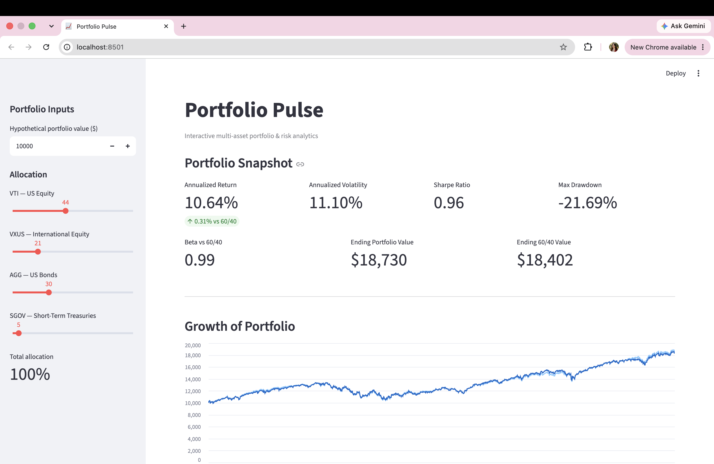
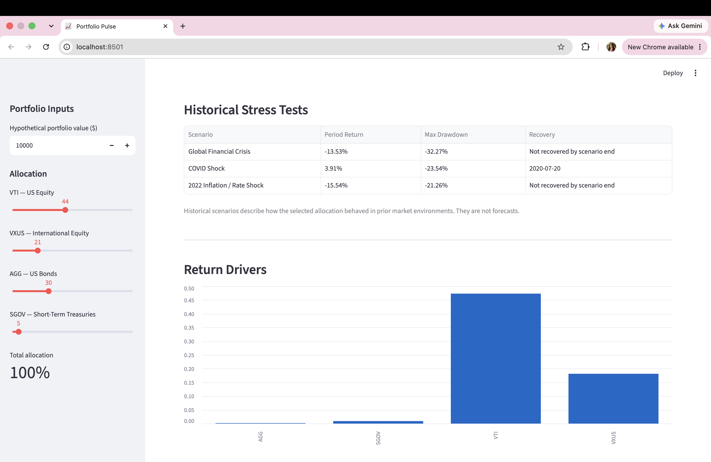
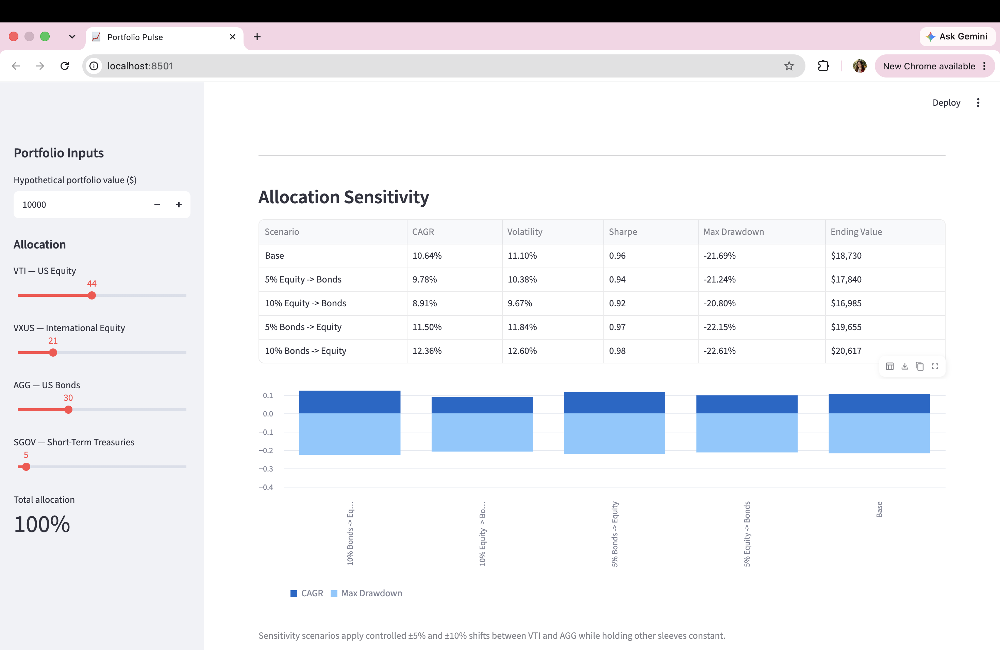

# Portfolio Pulse

Portfolio Pulse is a multi-asset portfolio analytics project built to evaluate allocation decisions, benchmark-relative performance, historical downside risk, and return drivers using real ETF market data.

## Live Demo

**[Launch Portfolio Pulse →](https://charlottekwon-portfolio-pulse.streamlit.app/)**

Interactive portfolio analysis with allocation controls, benchmark comparison, historical stress testing, return attribution, and allocation sensitivity.

### Portfolio Overview


### Historical Risk Analysis


### Attribution & Allocation Sensitivity


It combines:

- Python for market data and portfolio analytics
- Streamlit for interactive analysis
- Excel/VBA for an analyst-style workflow
- Historical stress testing
- Return attribution with reconciliation controls
- Allocation sensitivity analysis
- Unit tests for analytics and historical proxy handling

## What it does

Portfolio Pulse lets a user define an allocation across:

- VTI — US equities
- VXUS — international equities
- AGG — US investment-grade bonds
- SGOV — short-term US Treasuries

It then compares that allocation against a 60% VTI / 40% AGG benchmark.

The system calculates:

- annualized return
- annualized volatility
- Sharpe ratio
- maximum drawdown
- beta versus the 60/40 benchmark
- ending portfolio value
- historical wealth curves
- historical crisis performance
- arithmetic contribution by asset
- allocation sensitivity

## Why I built it

The project started from a simple question:

> How can portfolio analytics be rigorous enough for an investment workflow while still being understandable to a non-specialist?

The design therefore separates the finance engine from the presentation layer.

Python is the source of truth for calculations. Excel/VBA and Streamlit consume those outputs.

## Architecture

```text
Market data
   ↓
data.py
   ↓
portfolio.py + analytics.py
   ↓
market_engine.py
   ↓
├── stress testing
├── attribution
├── sensitivity
│
├── Streamlit
└── Excel / VBA
```

## Historical methodology

One challenge was ETF inception dates.

The current portfolio includes funds that did not all exist during earlier crises. Instead of silently backfilling them, Portfolio Pulse separates current-fund analysis from historical stress testing and uses disclosed proxies where necessary.

Examples:

- VXUS → VEU for the 2008–09 Global Financial Crisis
- SGOV → SHY where short-term Treasury history is required before SGOV existed

The application records substitutions rather than hiding them.

## Attribution methodology

Attribution is calculated as daily arithmetic contribution:

```text
daily contribution = portfolio weight × asset daily return
```

The system includes a reconciliation control that verifies:

```text
sum of asset contributions = portfolio daily return
```

The multi-period result is labeled cumulative arithmetic contribution. It is not presented as Brinson attribution.

## Allocation sensitivity

Portfolio Pulse evaluates controlled shifts around the selected allocation, including:

- 5% equity → bonds
- 10% equity → bonds
- 5% bonds → equity
- 10% bonds → equity

Each scenario recalculates:

- CAGR
- volatility
- Sharpe ratio
- maximum drawdown
- ending value

This highlights the historical trade-off between incremental return and additional downside risk.

## Running Streamlit

```bash
python3 -m pip install -r requirements_streamlit.txt
python3 -m streamlit run app.py
```

## Running tests

```bash
python3 -m pytest tests -v
```

The test suite covers:

- weight normalization
- weighted portfolio returns
- zero-volatility behavior
- maximum drawdown
- historical proxy resolution
- prevention of silent asset dropping
- attribution reconciliation

## Excel / VBA

The Excel implementation provides:

- editable portfolio weights
- validation controls
- Python-driven refresh
- dashboard KPIs
- stress-test outputs
- wealth curve
- attribution chart
- sensitivity analysis

On macOS, VBA uses `AppleScriptTask` to call the validated Python environment.

## Key finance takeaways

The project surfaced several useful observations:

- diversification does not automatically reduce drawdown;
- ending-period return can conceal severe path risk;
- stock/bond diversification behaves differently across inflation and rate regimes;
- benchmark-relative performance should be evaluated together with risk;
- attribution and sensitivity controls help explain why a portfolio behaved the way it did.

## Limitations

- Historical results do not predict future performance.
- The portfolio uses a small ETF universe.
- The Sharpe calculation depends on the selected risk-free-rate assumption.
- Historical proxies are approximations, not perfect replicas of later ETF exposures.
- Sensitivity scenarios are illustrative and are not investment recommendations.

## Tech stack

Python · pandas · NumPy · yfinance · Streamlit · Excel · VBA · openpyxl · pytest
